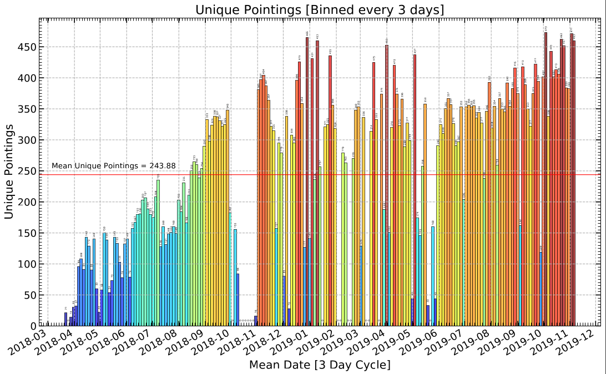
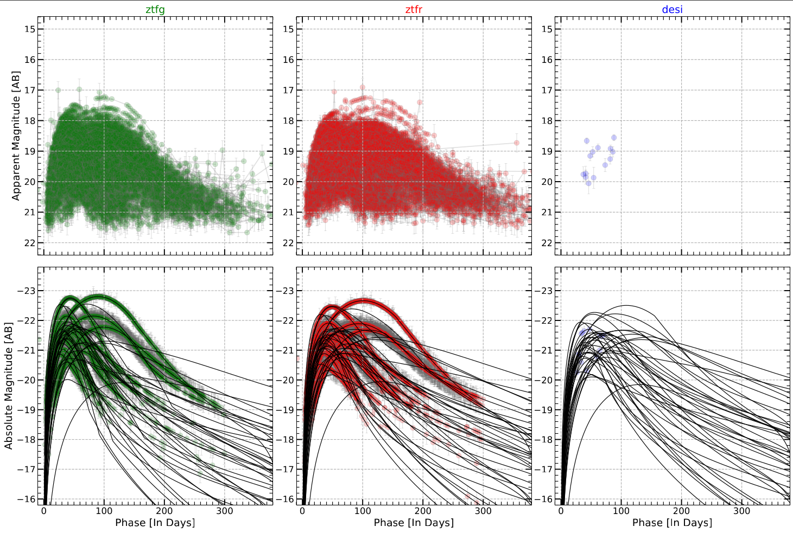
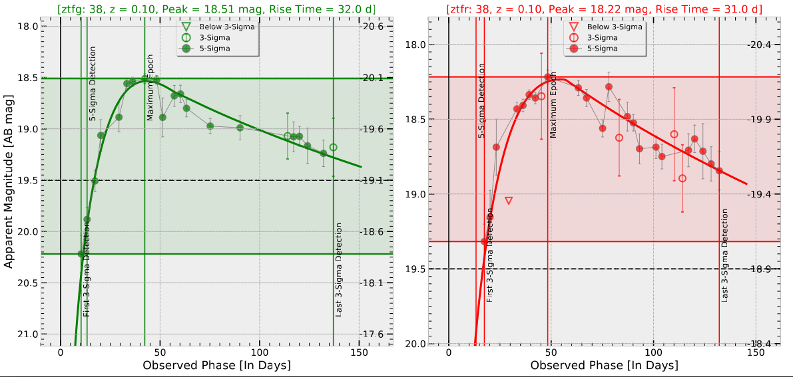

# SimSLSNe

Simulation code for estimating Volumetric Rates of Super-Luminous Supernovae (SLSNe) using data from Zwicky Transient Facility (ZTF). The code is built over the Simulation tool [simsurvey](https://github.com/ZwickyTransientFacility/simsurvey) developed by Ulrich Feindt (see Documentation [here](https://simsurvey.readthedocs.io/) and Paper [here](https://arxiv.org/abs/1902.03923)).

###Unique Pointings of ZTF (2018-2020)

###Simulated Set of LCs from ZTF

###Sample Simulated Light Curve and Parameter Extraction

The code is still under development.

Authors
-------

* **Avinash Singh** (IIA, Bengaluru)
* **Lin Yan** (Caltech, Pasadena)

Requirements
-------

- astropy
- sncosmo
- simsurvey
- matplotlib, seaborn (for plotting)
